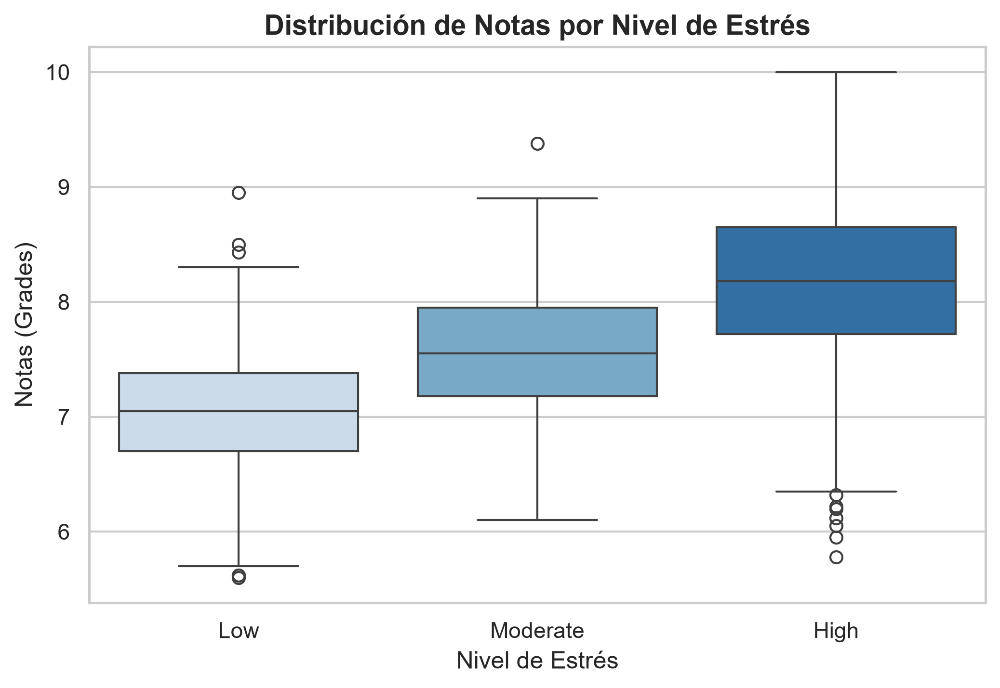
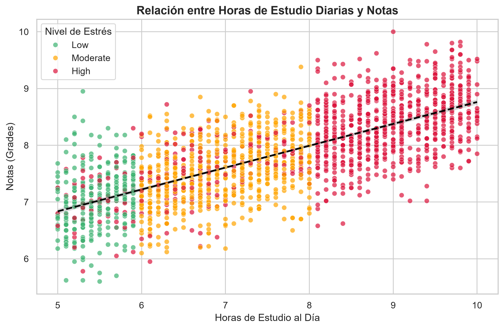

# 🎓 Impacto de los Hábitos de Vida en el Rendimiento Académico

Un análisis end-to-end de ciencia de datos y modelo de aprendizaje automático para evaluar cómo los hábitos diarios y la salud mental influyen en las calificaciones estudiantiles, planteando un **Sistema de Alerta Temprana** para prevenir la inestabilidad académica y el *burnout*.

---

## 📌 Resumen del Proyecto y Video Walkthrough

Este repositorio contiene la exploración de datos, la pipeline modular en Python y una presentación técnica orientada a la toma de decisiones institucionales.

> 📄 **Documentación visual:** Puedes consultar las diapositivas de la presentación en formato PDF dentro de la carpeta [`docs/Presentacion_Estilo_de_Vida_y_Notas.pdf`](docs/Presentacion_Estilo_de_Vida_y_Notas.pdf).

---

## 📊 Dataset y Variables

El análisis utiliza el dataset **"Lifestyle Factors and Their Impact on Students"**, obtenido en [Kaggle](https://www.kaggle.com/datasets/charlottebennett1234/lifestyle-factors-and-their-impact-on-students). El conjunto incluye 2.000 registros con las siguientes variables principales:

* **Hábitos de Vida:**
  * `Study_Hours_Per_Day`: Horas diarias dedicadas al estudio personal.
  * `Sleep_Hours_Per_Day`: Horas de descanso nocturno reportadas.
  * `Physical_Activity_Hours_Per_Day`: Tiempo diario en actividades deportivas/ejercicio.
  * `Social_Hours_Per_Day`: Horas destinadas a interacción social y ocio.
  * `Extracurricular_Hours_Per_Day`: Tiempo en proyectos o talleres adicionales.
* **Salud Mental:**
  * `Stress_Level`: Percepción de estrés (`Low`, `Moderate`, `High`).
* **Variable Objetivo:**
  * `Grades`: Calificación final promedio del estudiante.

---

## 🔍 Hallazgos Clave del Análisis Exploratorio (EDA)

1. **Rendimiento e Incremento del Estudio:** Existe una tendencia positiva y constante entre las horas de estudio y el promedio académico.
2. **Inestabilidad por Estrés (Análisis de Boxplot):**
   * Los estudiantes con niveles de estrés altos (`High`) presentan una mediana de notas más elevada debido a la alta exigencia académica.
   * Sin embargo, este mismo grupo exhibe la mayor variabilidad e inestabilidad, acumulando una concentración representativa de *outliers* o valores atípicos con calificaciones mínimas.
   * El grupo de bajo estrés (`Low`) mantiene un rendimiento significativamente más predecible y agrupado.

| Distribución por Estrés | Tendencia de Estudio |
| :---: | :---: |
|  |  |

---

## ⚙️ Arquitectura del Pipeline y Modelo Predictivo

El código fue refactorizado en un script modular (`src/main.py`) que utiliza `pathlib` para manejo dinámico de rutas y `scikit-learn` para el entrenamiento del modelo.

### Métricas del Modelo (`LinearRegression`):
* **División de datos:** 80% Entrenamiento / 20% Prueba a ciegas.
* **$R^2$ Score:** `0.5497` ($\approx 55\%$)
  * *Interpretación:* El 55% de la variabilidad en las calificaciones finales se explica directamente por la interacción combinada de los 5 hábitos diarios analizados.
* **$RMSE$:** `0.5128`
  * *Interpretación:* El modelo predice la nota real del estudiante con un margen de error promedio de solo $\pm 0.51$ puntos.

---

## 💡 Propuesta de Aplicación Industrial

Más allá del análisis descriptivo, la utilidad práctica de este pipeline es servir como **Sistema de Alerta Temprana** integrado en plataformas universitarias (LMS). El modelo permite identificar de forma automatizada a aquellos alumnos con combinaciones de hábitos desequilibrados (ej. alto estrés + privación de sueño) antes de que sufran caídas drásticas en sus calificaciones o reprobación de asignaturas.

---

### 👤 Autor
**Andersson Pinzon**  
[GitHub Profile](https://github.com/ander-nio)
